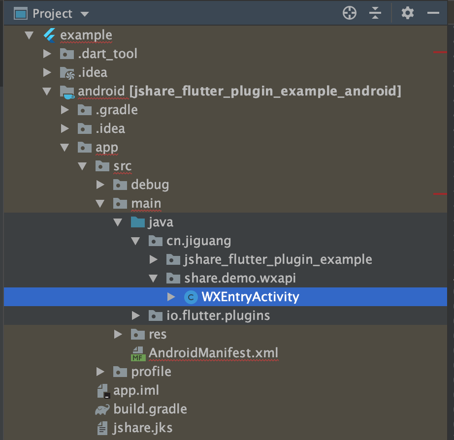
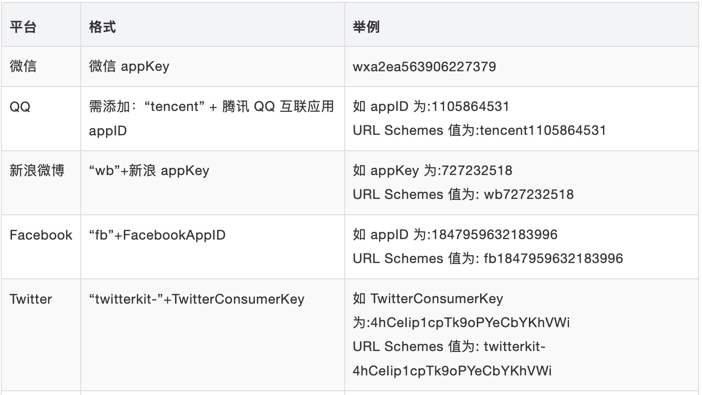
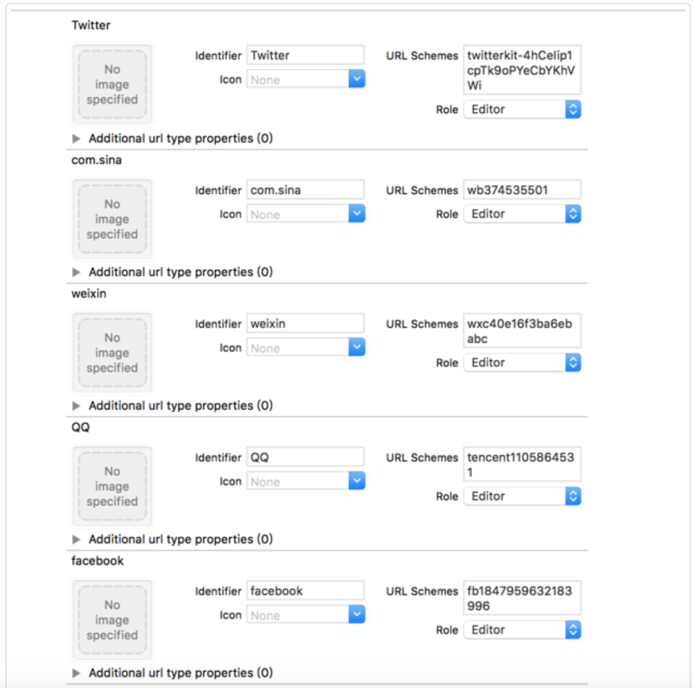

# jshare-flutter-plugin
JIGUANG officially supported JShare SDK Flutter plugin (Android &amp; iOS). 极光分享官方支持的 Flutter 插件（Android &amp; iOS）。


### 一、安装

在工程 pubspec.yaml 中加入 dependencies

+ github 集成 

``` 
dependencies:
  jshare_flutter_plugin:
    git:
      url: git://github.com/jpush/jshare-flutter-plugin.git
      ref: master
```

+ pub 集成

```
dependencies:
  jshare_flutter_plugin: 2.1.0
```

### 二、配置

#### 2.1 Android:

##### 2.1.1 gradle 配置

在 `example/android/app/build.gradle` 中添加下列代码：

```groovy
android: {
  ....
  defaultConfig {
    applicationId "替换成自己应用 ID"
    ...
    ndk {
	//选择要添加的对应 cpu 类型的 .so 库。
	abiFilters 'armeabi', 'armeabi-v7a', 'x86', 'x86_64', 'mips', 'mips64', 'arm64-v8a',        
    }

    manifestPlaceholders = [
        JPUSH_PKGNAME : applicationId,
        JPUSH_APPKEY : "appkey", // NOTE: JPush 上注册的包名对应的 Appkey.
        JPUSH_CHANNEL : "developer-default", //暂时填写默认值即可.
    ]
  }    
}
```

##### 2.1.2 配置微信平台回调

在你的包名相应目录下新建一个wxapi目录，并在该wxapi目录下新增一个WXEntryActivity类，该类继承自WeChatHandleActivity（例如应用程序的包名为cn.jiguang.share.demo，则新添加的类如下图所示）


注意： 如果复写了onCreate方法、onNewIntent方法，那么必须调用父类方法，否者无法获取分享结果，例如：

```
@Override
protected void onCreate(Bundle savedInstanceState) {
    super.onCreate(savedInstanceState);
}

@Override
protected void onNewIntent(Intent intent) {
    super.onNewIntent(intent);
}
```
+ 并在 manifest 文件里面加上exported属性，设置为true，例如：

```
<activity
    android:name=".wxapi.WXEntryActivity"
    android:theme="@android:style/Theme.Translucent.NoTitleBar"
    android:exported="true" />
```

##### 2.1.3 配置Facebook平台
+ 在`example/android/app/src/main/` 目录下的 `manifest` 文件里面添加 `Facebook`的`ContentProvider`配置：

```
<provider
    android:authorities="com.facebook.app.FacebookContentProvider您申请的facebook的AppId"
    android:name="cn.jiguang.share.facebook.FacebookContentProvider"
    android:exported="true"
/>
```
***注意：*** `provider`的`authorities`必须为`"com.facebook.app.FacebookContentProvider"+"AppId"`。
+ 如果需要获取`facebook`上传图片、视频结果可自定义`BroadCastReceiver`，继承`FacebookBroadcastReceiver`，复写`onSuccessfulAppCall、onFailedAppCall`方法：

```
<receiver android:name="cn.jiguang.share.demo.FaceBookUploadReceiver">
    <intent-filter>
        <action android:name="com.facebook.platform.AppCallResultBroadcast" />
    </intent-filter>
</receiver>
```
***注意***： `receiver`的`action`必须为`"com.facebook.platform.AppCallResultBroadcast"`。

#### 2.2 iOS
iOS 的功能目录为`example/ios/`
##### 2.2.1 配置 ApplicationQueriesSchemes

在 `iOS9/10` 下就需要增加一个应用可跳转的白名单，即 `LSApplicationQueriesSchemes`，否则将在 `SDK` 判断是否跳转时用到的`canOpenURL` 时返回 NO，进而只进行 `webview` 分享/分享失败。

在`example/ios/Runner/`目录中的`info.plist` 中加入应用白名单：

+ 右键 `info.plist`
+ 选择 source code
+ 添加如下内容：

```
<key>LSApplicationQueriesSchemes</key>
<array>
    <!-- 微信 URL Scheme 白名单-->
    <string>wechat</string>
    <string>weixin</string>

    <!-- 新浪微博 URL Scheme 白名单-->
    <string>sinaweibohd</string>
    <string>sinaweibo</string>
    <string>sinaweibosso</string>
    <string>weibosdk</string>
    <string>weibosdk2.5</string>

    <!-- QQ、Qzone URL Scheme 白名单-->
    <string>mqqapi</string>
    <string>mqq</string>
    <string>mqqOpensdkSSoLogin</string>
    <string>mqqconnect</string>
    <string>mqqopensdkdataline</string>
    <string>mqqopensdkgrouptribeshare</string>
    <string>mqqopensdkfriend</string>
    <string>mqqopensdkapi</string>
    <string>mqqopensdkapiV2</string>
    <string>mqqopensdkapiV3</string>
    <string>mqqopensdkapiV4</string>
    <string>mqzoneopensdk</string>
    <string>wtloginmqq</string>
    <string>wtloginmqq2</string>
    <string>mqqwpa</string>
    <string>mqzone</string>
    <string>mqzonev2</string>
    <string>mqzoneshare</string>
    <string>wtloginqzone</string>
    <string>mqzonewx</string>
    <string>mqzoneopensdkapiV2</string>
    <string>mqzoneopensdkapi19</string>
    <string>mqzoneopensdkapi</string>
    <string>mqqbrowser</string>
    <string>mttbrowser</string>

    <!-- Facebook URL Scheme 白名单-->
    <string>fbapi</string>
    <string>fb-messenger-api</string>
    <string>fbauth2</string>
    <string>fbshareextension</string>

    <!-- Twitter URL Scheme 白名单-->
    <string>twitter</string>
    <string>twitterauth</string>

    <!-- JChatPro URL Scheme 白名单-->
    <string>JChatPro</string>
</array>
```

##### 2.2.2 添加 URL Types

+ 各个平台的 URL Schemes 格式说明：


+ URL Types 设置
	
	Xcode 打开工程 `example/ios/Runner.xcworkspace`目录中的 [TARGETS] -> [Info] 中设置： 


##### 2.3 iOS/Android 详细集成配置文档
+ [iOS 集成配置](https://docs.jiguang.cn/jshare/client/iOS/ios_sdk/)
+ [Android 集成配置](https://docs.jiguang.cn/jshare/client/Android/android_sdk/)

### 三、使用

```dart
import 'package:jshare_flutter_plugin/jshare_flutter_plugin.dart';
```

### APIs

**注意** : 需要先调用 JShare.setup 来初始化插件，才能保证其他功能正常工作。

 [参考](./documents/APIs.md)

